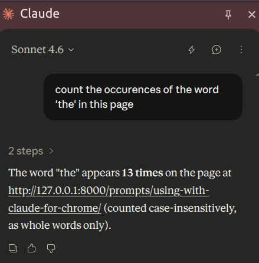

(use-claude-with-chrome)=
# Use Claude with Chrome

Some prompts in this collection, notably {ref}`set-up-google-analytics`,
rely on Claude's ability to to operate a real web UI on your behalf.
For these to work, Claude needs to be connected to Chrome.

## Prerequisites

- The [Claude for Chrome](https://chromewebstore.google.com/detail/claude/fcoeoabgfenejglbffodgkkbkcdhcgfn) extension installed in Google Chrome.
- A paid Claude plan that includes Claude Code;
  the extension is currently gated to paid tiers.
- Logged-in access in that same Chrome profile to whatever the prompt drives
  (in the GA4 case, your Google Analytics account).

## Anthropic's docs

- Product page and install link: https://claude.com/claude-for-chrome
- Getting started guide (install, permissions, first run):
  https://support.claude.com/en/articles/12012173-getting-started-with-claude-for-chrome

## Running the prompts

### GUI

1. Open Chrome with the Claude extension installed and signed in.
2. Open the target site in a tab and confirm you're logged in.
3. Open the Claude side panel, paste the prompt, and let Claude take over:

   

4. Watch the first few actions;
   the extension asks for confirmation on sensitive steps,
   and you can stop it at any point.

### CLI

Alternatively, you can run `claude --chrome`
and paste the prompt in the terminal UI.
